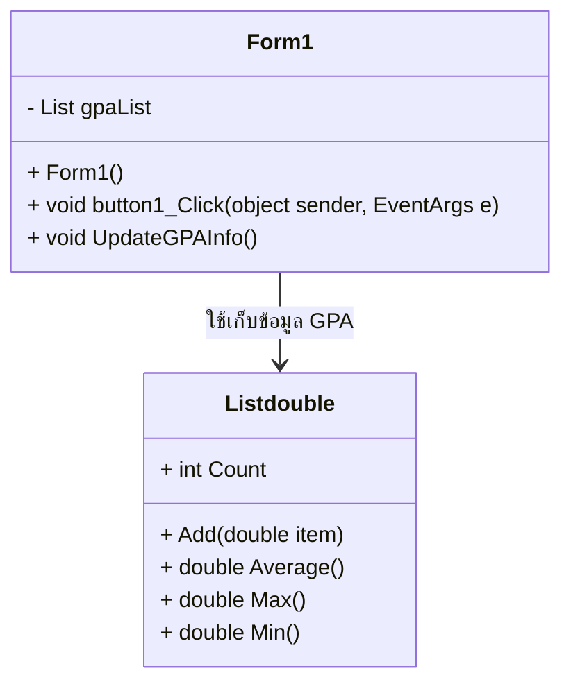

# GPA Calculator (WinForms)

โปรแกรมนี้เป็น **GPA Calculator** สำหรับคำนวณเกรดเฉลี่ยของนักศึกษา  
สามารถคำนวณ **GPAx (ค่าเฉลี่ย), GPA สูงสุด, GPA ต่ำสุด และ จำนวนคนที่ป้อนเกรด**  

## 📌 Features
- เพิ่มเกรดนักศึกษาและคำนวณ GPA
- แสดง **ค่าเฉลี่ย GPA, จำนวนคน, คะแนนสูงสุด, คะแนนต่ำสุด**
- ใช้ **WinForms (C#)** ในการพัฒนา

## 📌 Class Diagram

 1. Form1 (UI หลักของโปรแกรม)
    เป็น คลาสหลัก ที่จัดการกับอินเทอร์เฟซผู้ใช้ (UI)
    มีตัวแปร gpaList เป็น List ที่ใช้เก็บค่าคะแนน GPA
    มีเมธอดสำคัญ 2 ตัว
    button1_Click() 👉 ฟังก์ชันที่ทำงานเมื่อผู้ใช้กดปุ่ม เพื่อเพิ่ม GPA
    UpdateGPAInfo() 👉 คำนวณค่าเฉลี่ย, จำนวนคน, คะแนนสูงสุด และต่ำสุด
 2. List<double> (โครงสร้างข้อมูล)
    ใช้เก็บ ค่าคะแนน GPA ที่ผู้ใช้ป้อน
    มีเมธอดหลัก
    Add(double item) 👉 เพิ่มค่า GPA
    Average() 👉 คำนวณค่าเฉลี่ยของคะแนนทั้งหมด
    Max() 👉 คืนค่า GPA สูงสุด
    Min() 👉 คืนค่า GPA ต่ำสุด
    Count 👉 คืนค่าจำนวนคนที่ป้อน GPA
