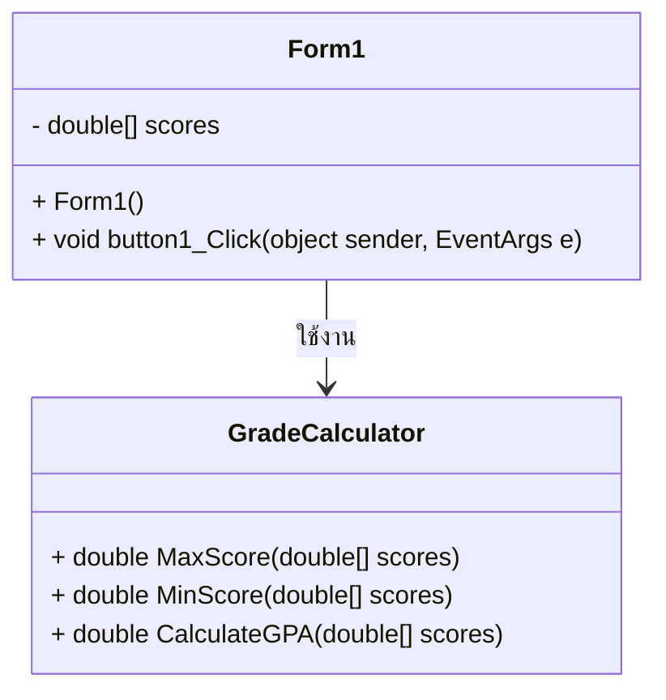

# Grade Calculator (WinForms)

## 📝 รายละเอียดโปรแกรม
โปรแกรมคำนวณเกรดโดยรับคะแนนจากผู้ใช้ และแสดง **คะแนนสูงสุด, คะแนนต่ำสุด, GPA, และจำนวนคน**  
ใช้ภาษา **C# (WinForms)** และออกแบบโครงสร้างโดยใช้ **Class Diagram**  

## 📌 Class Diagram

1.Form1

เป็นคลาสหลักที่จัดการ UI (User Interface)
รับค่าคะแนนจากผู้ใช้และแสดงผลลัพธ์
เมื่อกดปุ่มคำนวณ จะเรียกใช้ GradeCalculator
2.GradeCalculator

เป็นคลาสที่ใช้คำนวณค่าต่างๆ เช่น
✅ คะแนนสูงสุด
✅ คะแนนต่ำสุด
✅ GPA (ค่าเฉลี่ย)
3.ความสัมพันธ์ระหว่างคลาส

Form1 เรียกใช้ GradeCalculator เพื่อคำนวณค่าต่างๆ และแสดงผลให้ผู้ใช้ดู
